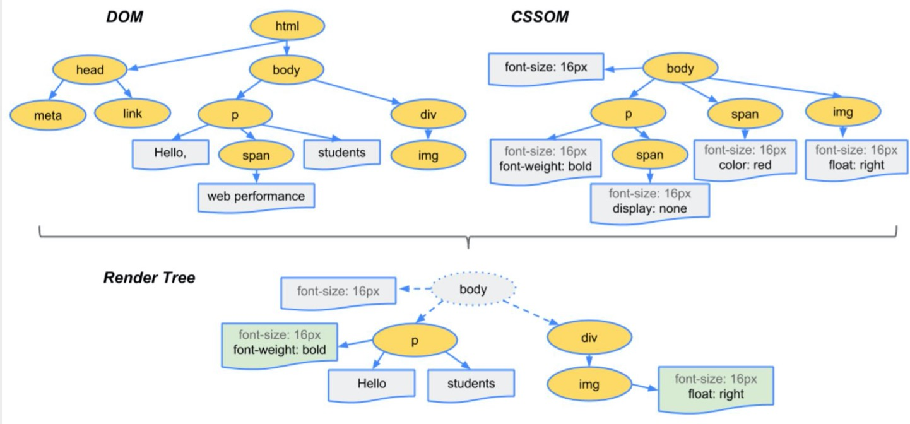

#  css知识总结
## 浏览器渲染原理
###  1.根据HTML构建HTML树(DOM)
###  2.根据CSS构建CSS树(CSSOM)
###  3.将两棵树合并成一颗渲 染树(render tree)
###  4.Layout布局(文档流、盒模型、计算大小和位置)
###  5.Paint绘制(把边框颜色、文字颜色、阴影等画出来)
###  6.Compose合成(根据层叠关系展示画面)

 

### 需要注意的是，以上五个步骤并不一定一次性顺序完成，比如DOM或CSSOM被修改时，亦或是哪个过程会重复执行，这样才能计算出哪些像素需要在屏幕上进行重新渲染。而在实际情况中，JavaScript和CSS的某些操作往往会多次修改DOM或者CSSOM。

 

## 浏览器渲染网页的具体流程

### 2.1 构建DOM树

#### 当浏览器客户端从服务器那接受到HTML文档后，就会遍历文档节点然后生成DOM树，DOM树结构和HTML标签一一对应。需要注意记下几点：

 

#### DOM树在构建的过程中可能会被CSS和JS的加载而执行阻塞。（这在后面会详细介绍。）

 

#### display:none 的元素也会在DOM树中。

 

#### 注释也会在DOM树中

 

#### script标签会在DOM树中

### 2.2 CSS解析

#### 浏览器会解析CSS文件并生成CSS规则树，在过程中，每个CSS文件都会被分析成StyleSheet对象，每个对象都包括CSS规则，CSS规则对象包括对应的选择器和声明对象以及其他对象。

 

#### 在这个过程需要注意的是：

 

#### CSS解析可以与DOM解析同进行。

 

#### CSS解析与script的执行互斥 。

 

#### 在Webkit内核中进行了script执行优化，只有在JS访问CSS时才会发生互斥。

 

### 2.3 构建渲染树（Rendr tree construction）

 

#### 通过DOM树和CSS规则树，浏览器就可以通过它两构建渲染树了。浏览器会先从DOM树的根节点开始遍历每个可见节点，让后对每个可见节点找到适配的CSS样式规则并应用。具体的规则有以下几点需要注意：

 

#### Render Tree和DOM Tree不完全对应。

 

#### display: none的元素不在Render Tree中

 

#### visibility: hidden的元素在Render Tree中

 

### 2.4 渲染树布局(layout of the render tree)

 

#### 布局阶段会从渲染树的更节点开始遍历，由于渲染树的每个节点都是一个Render Object对象，包含宽高，位置，背景色等样式信息。所以浏览器就可以通过这些样式信息来确定每个节点对象在页面上的确切大小和位置，布局阶段的输出就是我们常说的盒子模型，它会精确地捕获每个元素在屏幕内的确切位置与大小。需要注意的是：

 

#### float元素，absoulte元素，fixed元素会发生位置偏移。

 

#### 我们常说的脱离文档流，其实就是脱离Render Tree。

 

### 2.5 渲染树绘制（Painting the render tree）

#### 在绘制阶段，浏览器会遍历渲染树，调用渲染器的paint()方法在屏幕上显示其内容。渲染树的绘制工作是由浏览器的UI后端组件完成的。

 

 

## CSS动画的两种做法

 

### transition

 

transition CSS 属性是 
####  transition-property
####  transition-duration
#### transition-timing-function
#### transition-delay 

 

#### 过渡可以为一个元素在不同状态之间切换的时候定义不同的过渡效果。比如在不同的伪元素之间切换，像是 :hover，:active 或者通过 JavaScript 实现的状态变化。

### 语法

 

<code>
/* Apply to 1 property */
/* property name | duration */
transition: margin-right 4s;

/* property name | duration | delay */
transition: margin-right 4s 1s;

/* property name | duration | timing function */
transition: margin-right 4s ease-in-out;

/* property name | duration | timing function | delay */
transition: margin-right 4s ease-in-out 1s;

/* Apply to 2 properties */
transition: margin-right 4s, color 1s;

/* Apply to all changed properties */
transition: all 0.5s ease-out;

/* Global values */
transition: inherit;
transition: initial;
transition: unset;
</code>

 

### CSS animation 属性
#### 实例
#### 使用简写属性，将动画与 div 元素绑定：
<code>
div
{
animation:mymove 5s infinite;
-webkit-animation:mymove 5s infinite; /* Safari 和 Chrome */
}
</code>

 

#### 定义和用法
#### animation 属性是一个简写属性，用于设置六个动画属性：
#### animation-name
#### animation-duration
#### animation-timing-function
#### animation-delay
#### animation-iteration-count
#### animation-direction
#### 注释：请始终规定 animation-duration 属性，否则时长为 0，就不会播放动画了。

 

##   以上是对css的学习的小结